1. Buka laman resmi AWS https://aws.amazon.com/

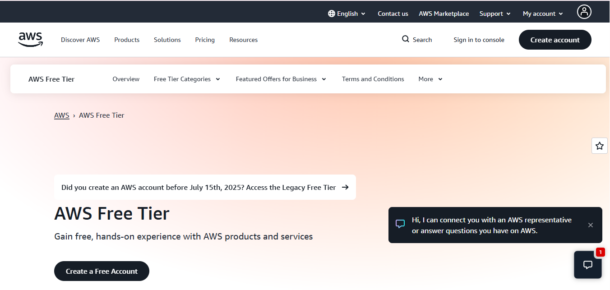

2. Pilih Menu Create Akun, masukan email & nama akun

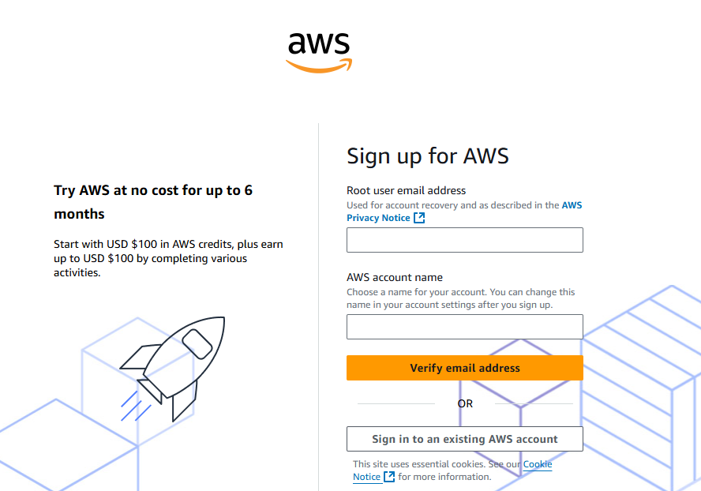

3. Verify Email

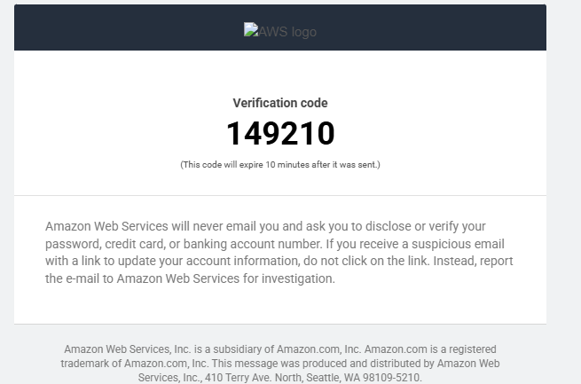

4. Masukan Kode Verify

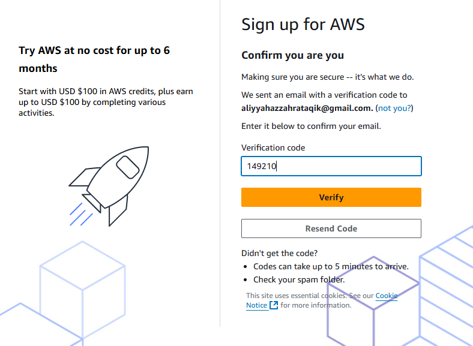

5. Membuat Password

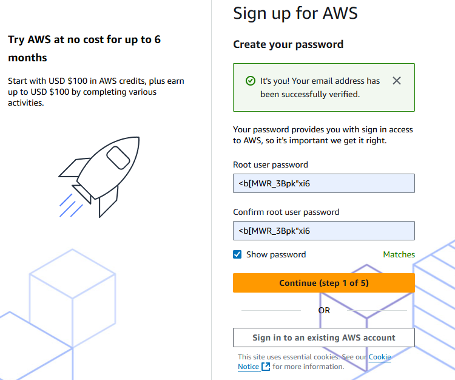

6. Pilih Free Tier

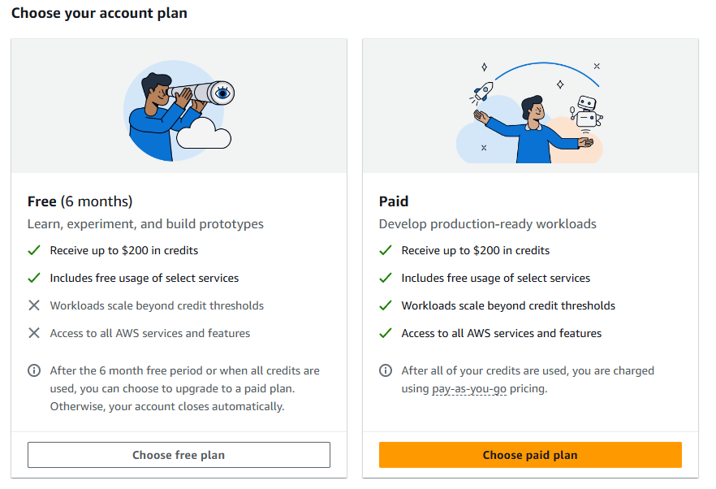

7. Mengisi Form

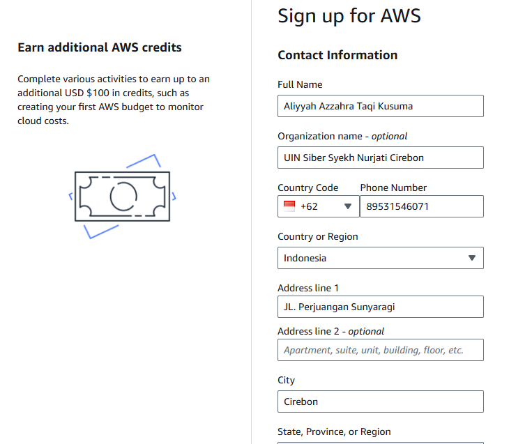

8. Masukan Credit Card Number

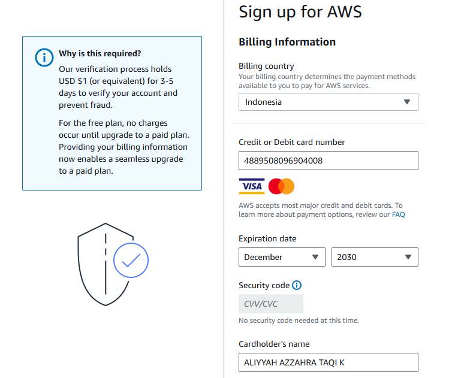

9. Verify Payment

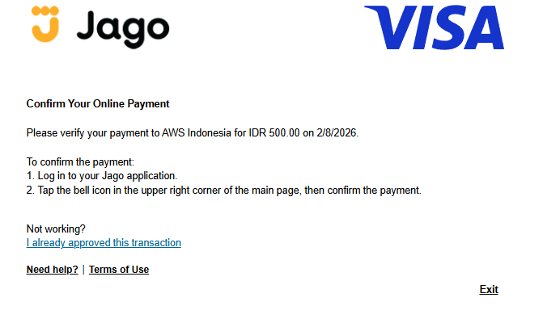

10. Konfirmasi Identitas

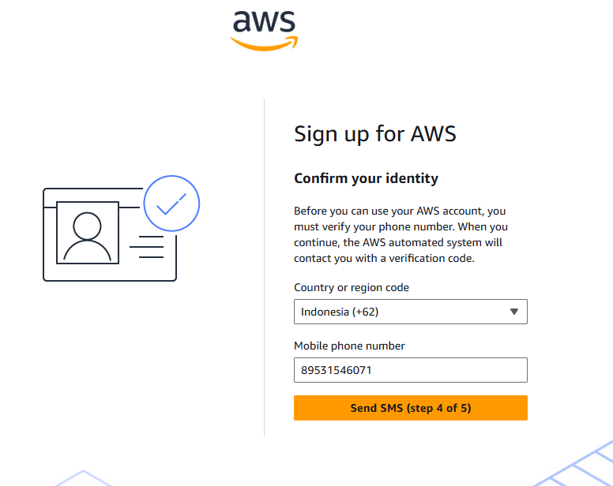

11. Verify Kode

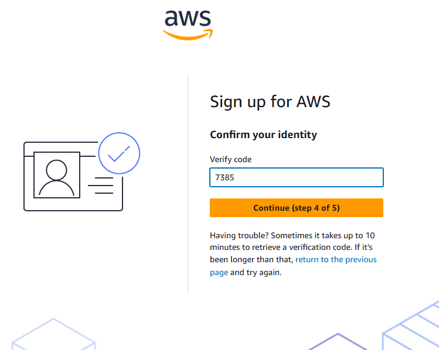

12. Tanda Berhasil

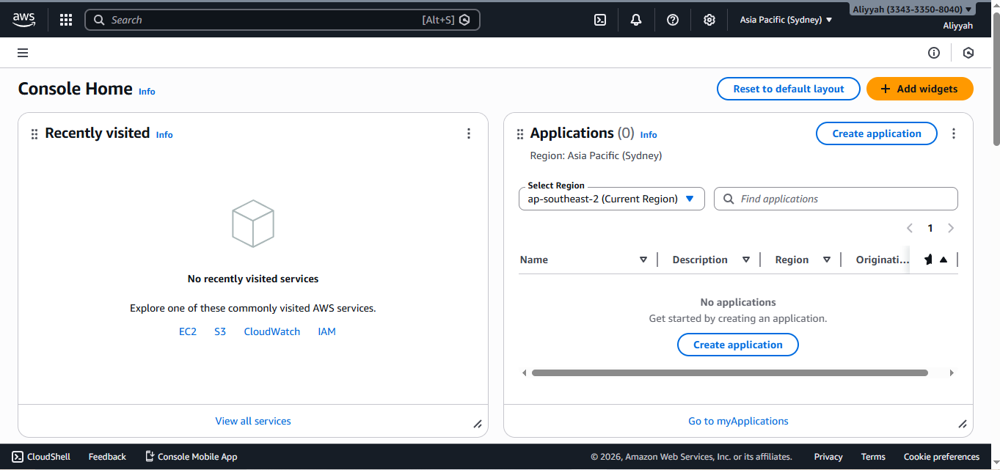 