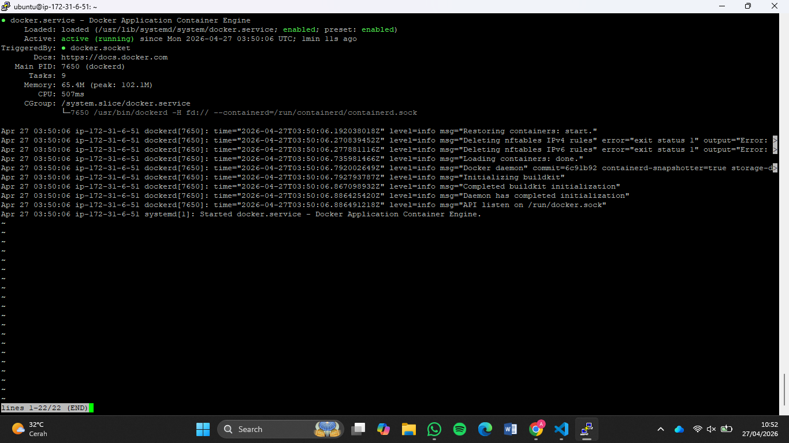
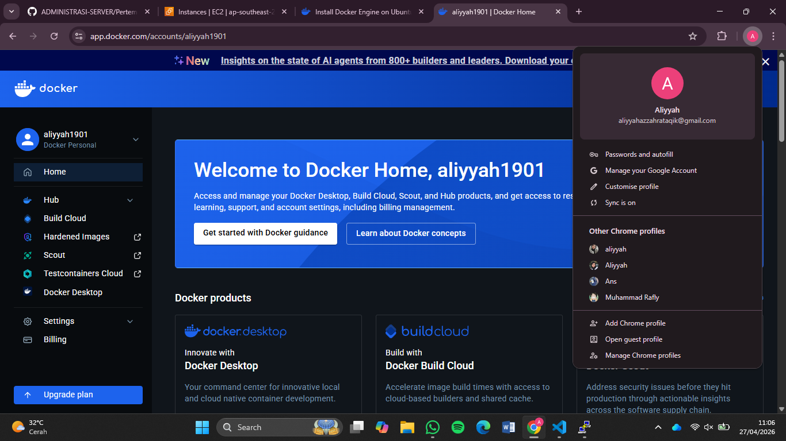
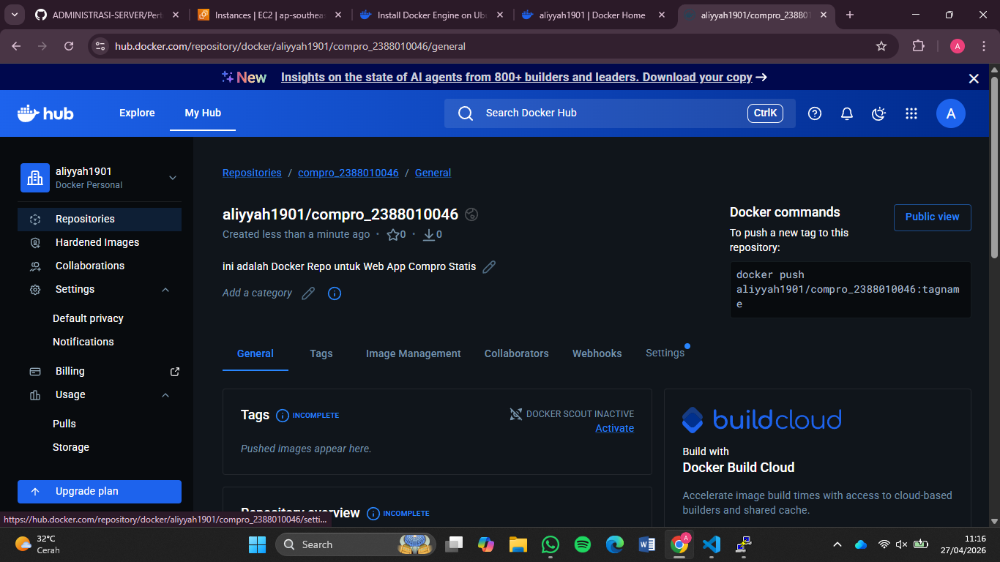
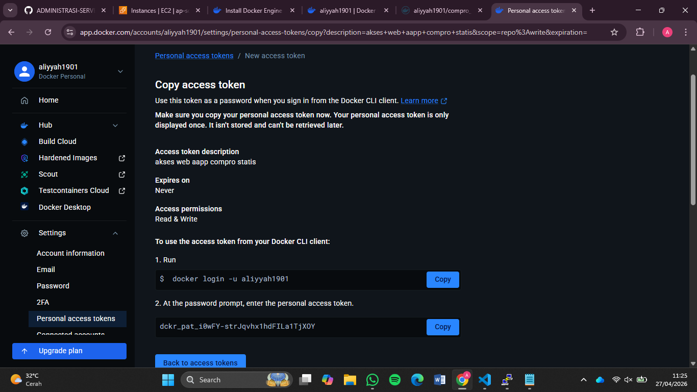
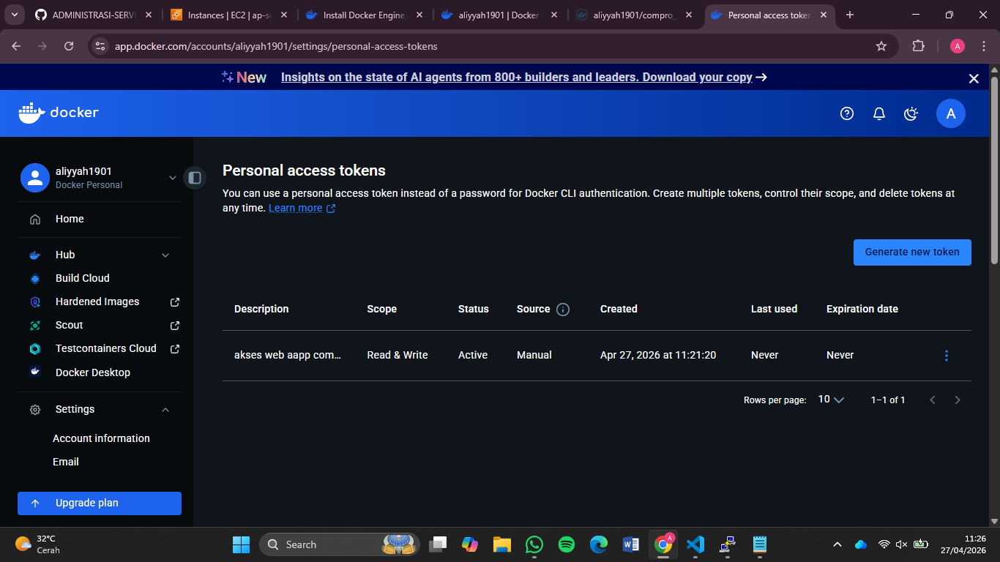
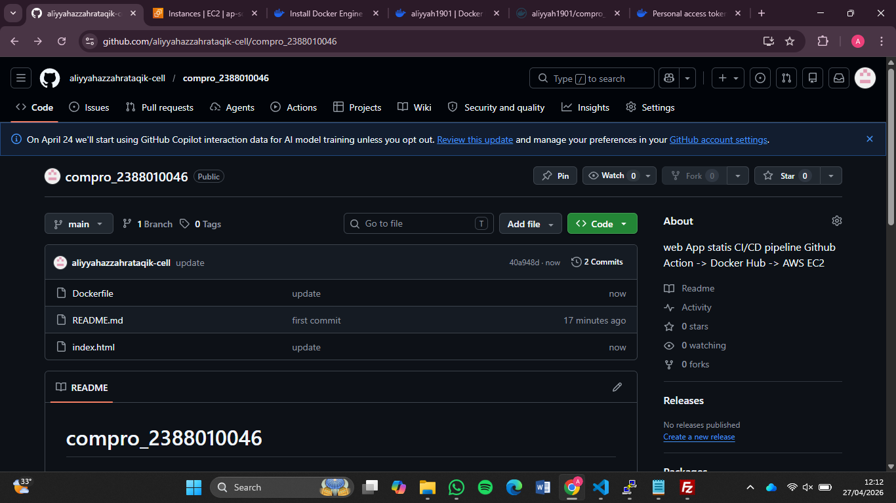

# Create Docker Engine in Insttance EC2 AWS

1. Install based Docker Documentation (https://docs.docker.com/engine/install/ubuntu/)

    - Uninstall old version docker sudo apt remove $(dpkg --get-selections docker.io docker-compose docker-compose-v2 docker-doc podman-docker containerd runc | cut -f1)
    - Install Docker
    - sudo apt-get update && sudo apt-get upgrade
    - Add Docker Repository to APT Types: deb URIs: https://download.docker.com/linux/ubuntu Suites: 
    Unable to render expression.
    $(. /etc/os-release &amp;&amp; echo "${UBUNTU_CODENAME:-$VERSION_CODENAME}") Components: stable Architectures: $(dpkg --print-architecture) Signed-By: /etc/apt/keyrings/docker.asc EOF
    - Update OS -> sudo apt update
    - Install Docker Engine -> sudo apt install docker-ce docker-ce-cli containerd.io docker-buildx-plugin docker-compose-plugin
    - cek installation -> sudo systemctl status docker

2. Registrasi Docker Hub

    - URL Docker Hub -> https://hub.docker.com/repository/docker/merinkharista/compro_2388010050/general
    - Continue with Github
    - Login

3. Create Repository for Docker

    - Klik menu -> Hub -> Repositories
    - Klik button new repositories
    - Isi nama repository = compro_2388010050 dan deskripsi = Ini adalah Docker Repo untuk Web App Compro Statis
    - Visibility = public
    - Klik create 

4. Create token access

    - Klik Profile -> Settings -> personal access tokens
    - Klik Generate New Token
    - Ini Deskripsi
    - Expire Date = none
    - Access Permissions = read/write
    - Klik Generate

5. Create Projek di Local

    - Buat folder compro_2388010050
    - Masukkan file index.html compro
    - Buat file Dockerfile dengan isi sebagai berikut FROM nginx:alpine COPY index.html /user/share/mginx/html EXPOSE 80

6. Push Github

