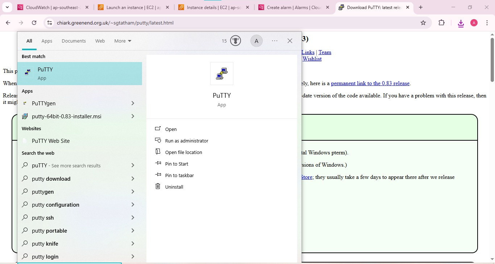
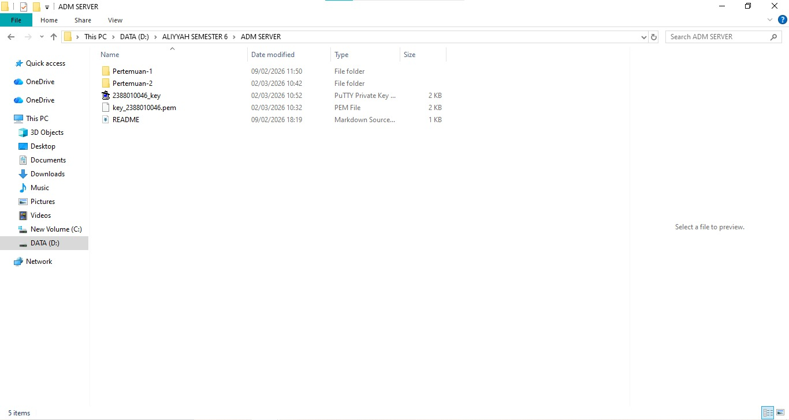
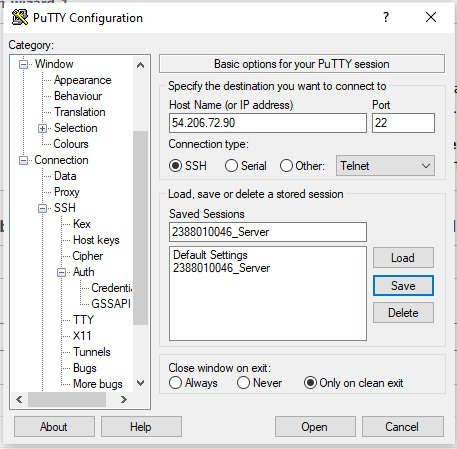
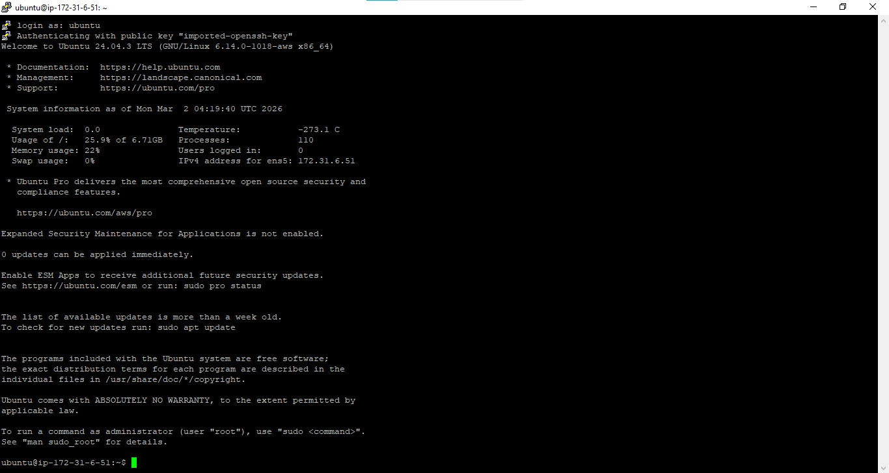
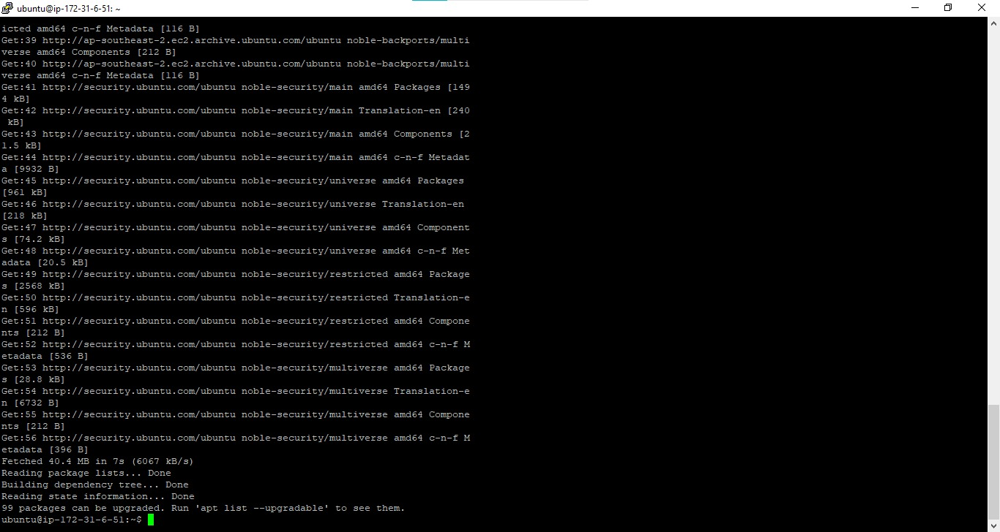
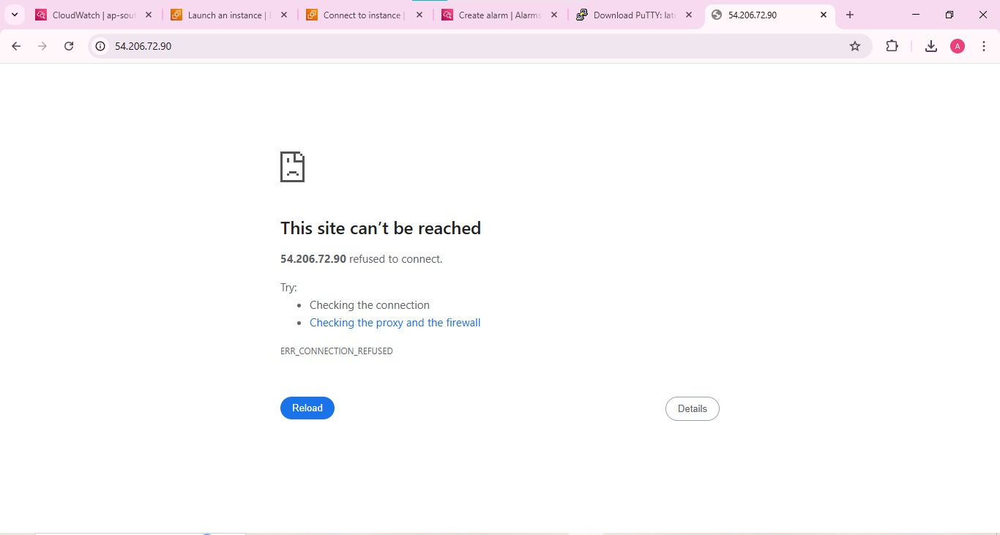
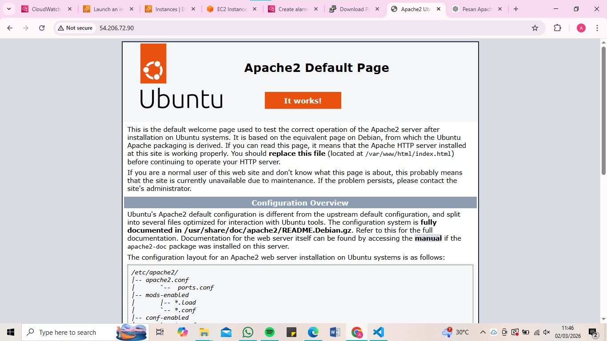
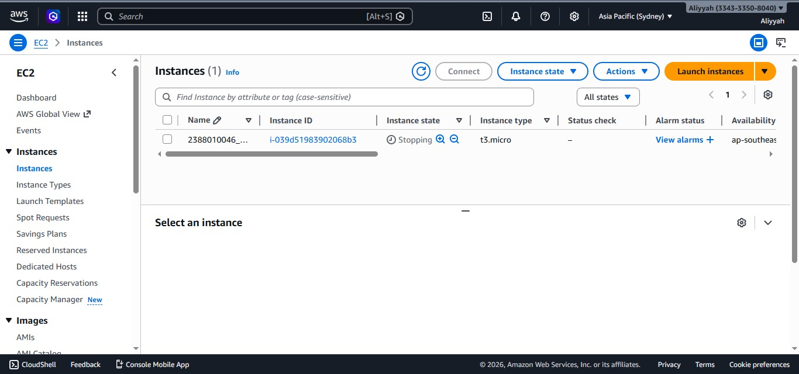

# Remote Instance with SSH Putty

1. Pastikan sudah install Putty

2. Konversi file Public key dari .pem menjadi .ppk di putty
- buka puttyGen
- load File .pem
- Save as .ppk

3. Set Up Putty untuk Remote SSH
- buka apps Putty
- Isi IP Public sesuai instance
- Isi Nama session agar saat connect lagi tinggal load saja
- load file .ppk (Klik SSH-> Auth -> Credentials ->load file .ppk)
- kembali ke session klik save
- klik open
- masukan username ssesuai instance

4. "sudo apt-get update" (update OS) lanjut "sudo apt-get upgrade"

5. pembuktian remote SSH secara visual
- Copy public IP Address instance paste ke browser

- install web server seperti Apache/Nginx
- sudo apt install apache2
- Reload Browser

6. Matikan Instance agar tidak kena tagihan
- sudo shutdown now 

