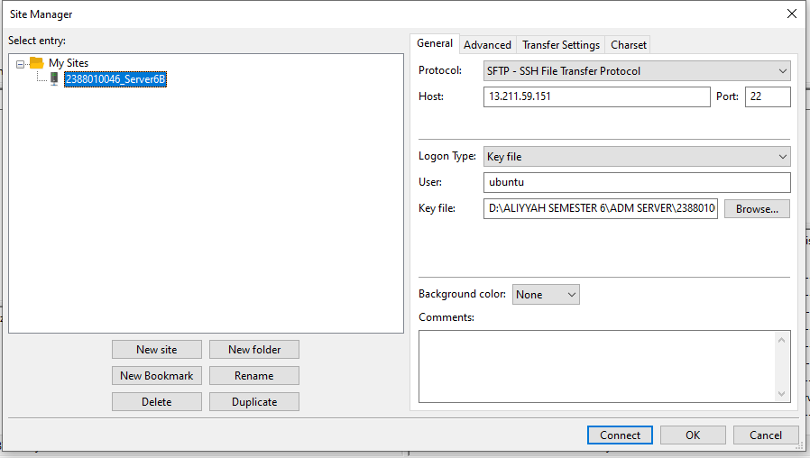
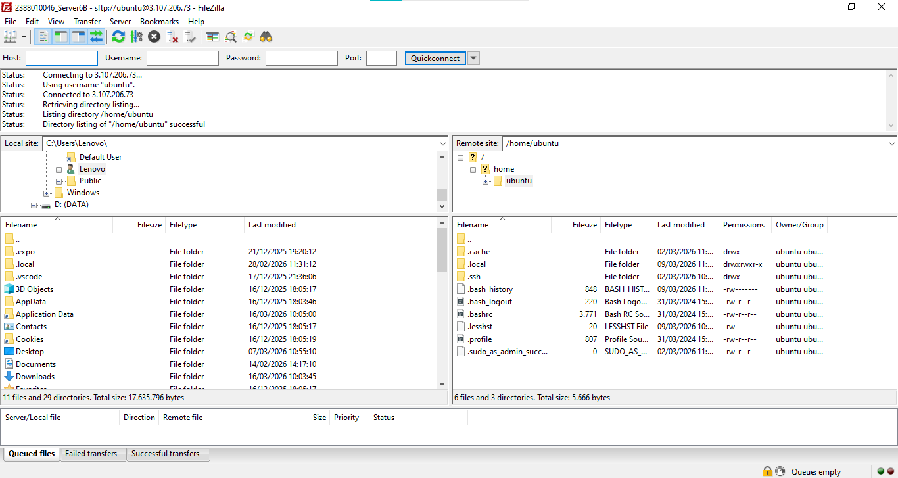
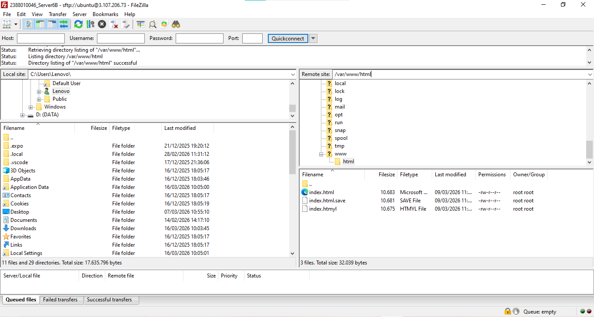
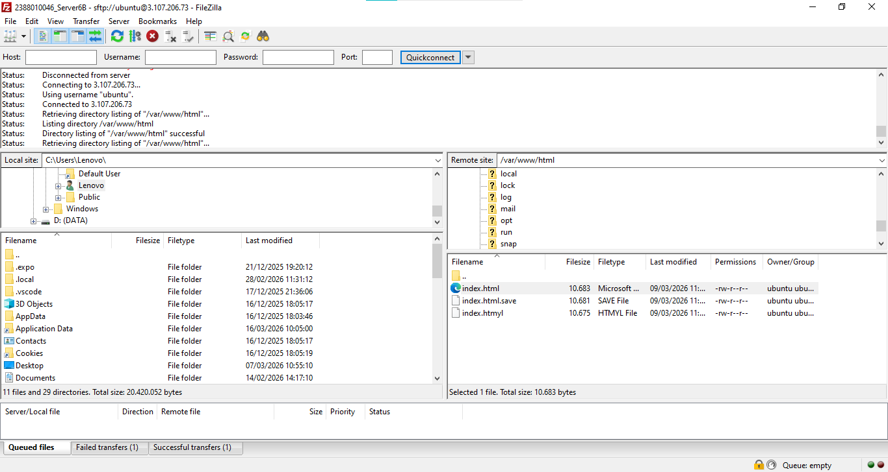
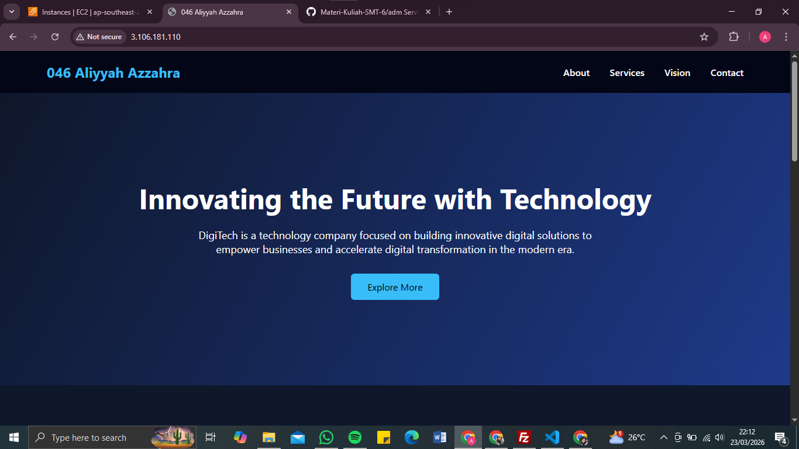

# Migrasi File Local ke Cloud Server (AWS EC2)

1. Memilih tools Migrasi File, misal kita akan gunakan Filezila
-  unduh dan install filezila 
-  buka filezilla client
-  aktifkan instance di AWS
-  kembali ke filezila client
-  klik file > site manager
-  klik new site
-  protocol > SFTP
-  host > IP public EC2
-  port > 22
-  logon type > key file
-  user > ubuntu
-  key file > pilih file .ppk/ .pem yang di download saat membuat instance
-  kilik ok
CTRL + S
klik Connect

2. Pada dashboard utama filezilla akan terbagi menjadi 2 panel
    - Panel kiri > file local (komputer anda)
    - Panel kanan > file server (AWS EC2)

3. arahkan directory cloud (panel kanan) ke folder web server service area 
-  /var/www/html

4. untuk solusi permssion denied pada folder /var/www/html
-  ubah kepemilikan folder
-  mengubah folder /var/www/html agar bisa diakses oleh user 'ubuntu'
-  sintaks sudo chown -R ubuntu:ubuntu /var/www/html sudo chown -R ubuntu:ubuntu /var/www/html

5. edit file index.html menjadi company profile
-  klik kanan pada file index.html
-  klik edit
-  edit file.html menjadi company profile

