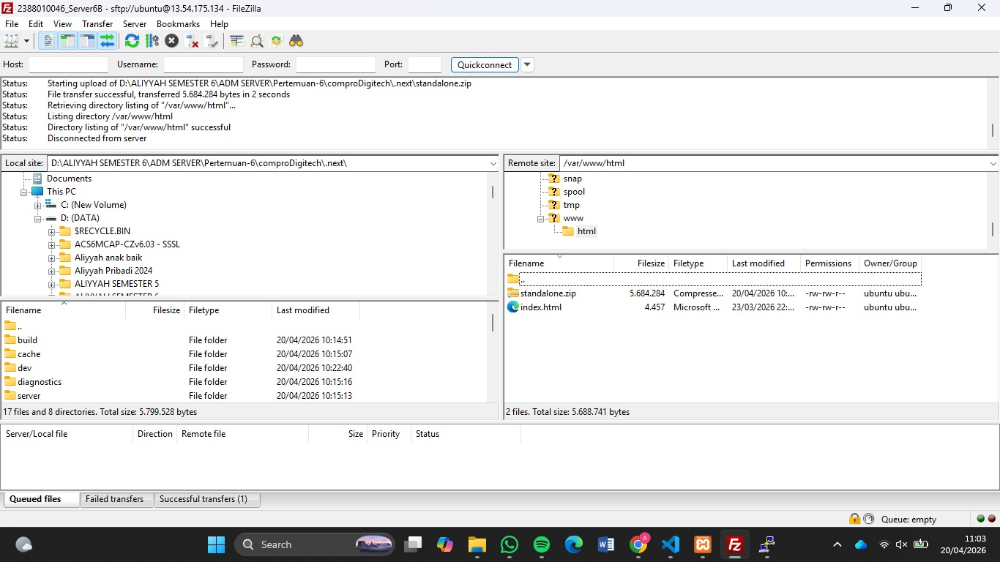
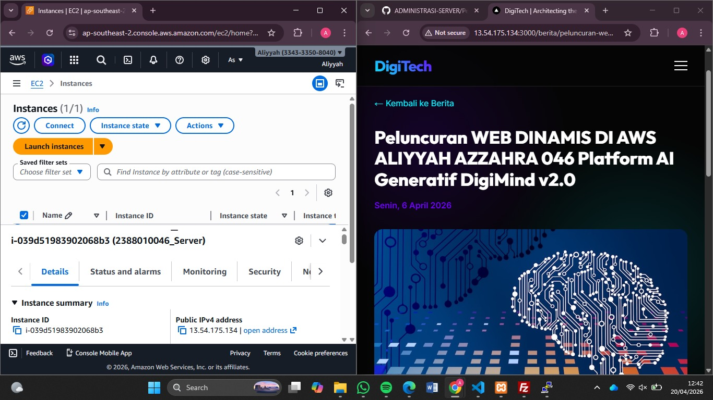
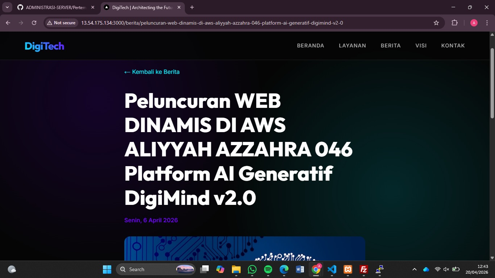

# Melakukan Uploading web apss dynamic ke EC2 AWS

1. Pastikan web apps dynamic sudah berjalan di local
2. Jika sudah tanpa error kita akan membaut folder build
    - npm run build
    - pastikan menampilkan folder .next/standalone didalam tersedia folder static

3. Proses Upload File Folder StandAlone
    - lakukan proses archive pada folder .next/standalone dan folder public.zip
    - running instance -> connect open ssh -> open filezilla
    - upload file hasil archive .zip standalone ke ec2 AWS menggunakan Filezilla

    - extract file hasil archive di ec2 aws
    - install tools unzip di ec2 aws
    - sudo apt install unzip -y
    - extract file hasil archive di ec2 aws
    - unzip standalone.zip

4. export dbCompro dari localhost import ke ec2 AWS
    - login ke SQL ec2 sudo mysql -u USERCOMPRO -p
    - use dbCompro;
    - copy paste query SQL dari export dbCompro di Localhost
    - cek setiap tabel aoakah sudah terisi
    - select * from berita;
    - select * from users;

5. sesuaikan isi dile .env di ec2 aws
    - DB_HOST=localhost
    - DB_USER=USERCOMPRO
    - DB_PASSWORD=PASSWORD
    - DB_NAME=dbCompro
    - ctrl s

6. di terminal ssh cd ke folder standalone run apps -pm2 start server.js -pm2 save -pm2 startup

7. Buka port 3000 di security group ec2 aws
    - edit security group
    - add rule
    - save
    - check perubahan

