# UAS Administrasi Server 6B Aliyyah Azzahra Taqi Kusuma 2388010046

# WEB-STATIS
1. Buat Instance EC2 Baru dan Running

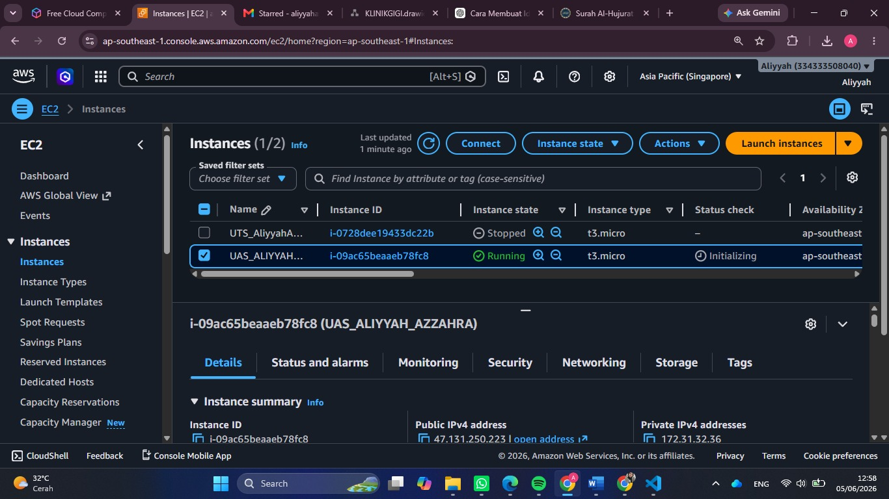

2. Buat Security Group 

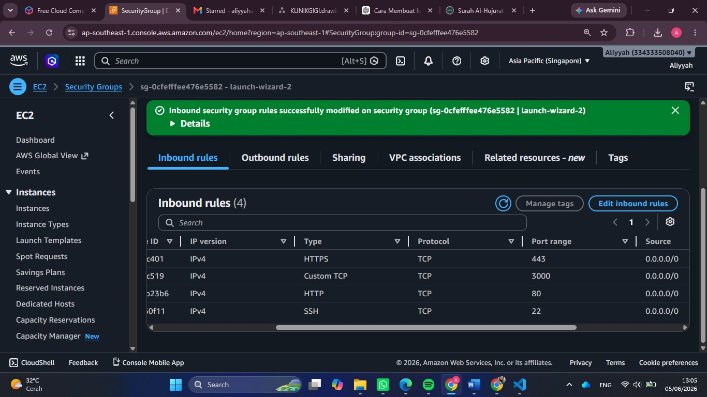

3. Patching OS 

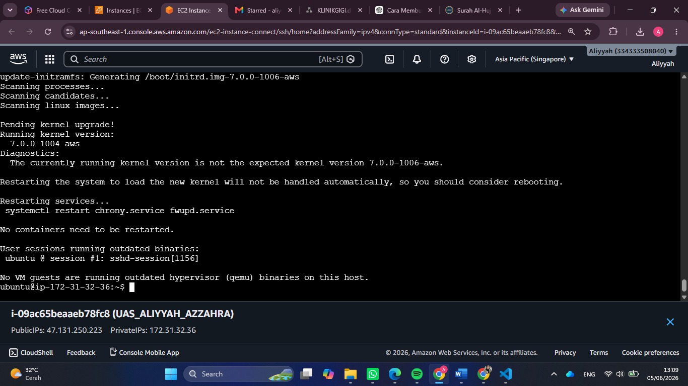

4. Buat Repo Github dan setting secret_key

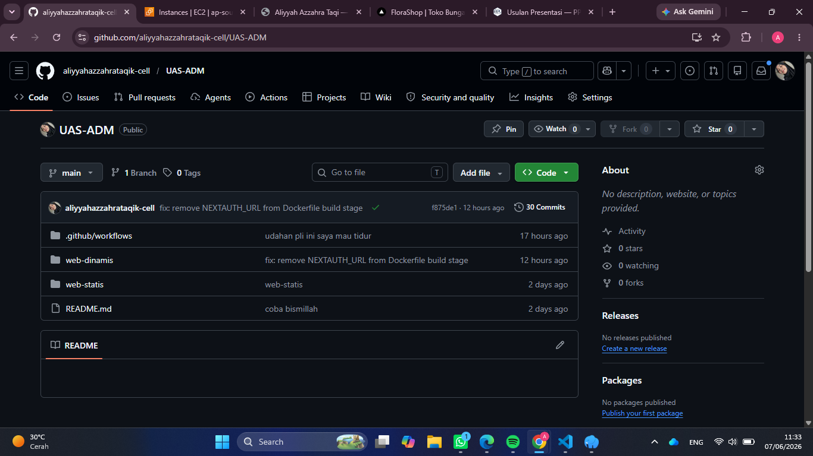

5. Install docker di terminal dan cek systemctl running

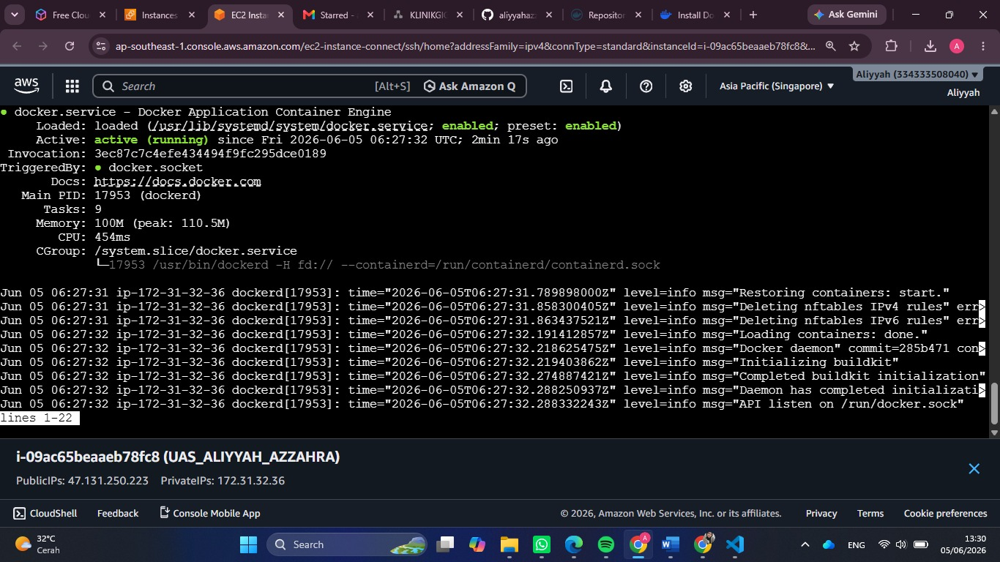 

6. Buat Repo baru di Docker

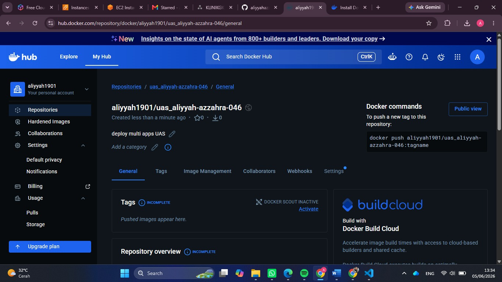 

7. Buat Token di Docker

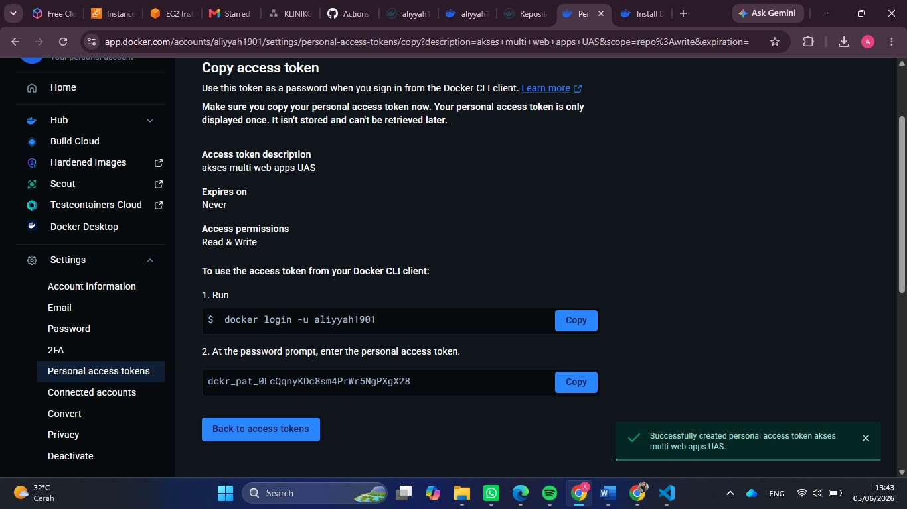 

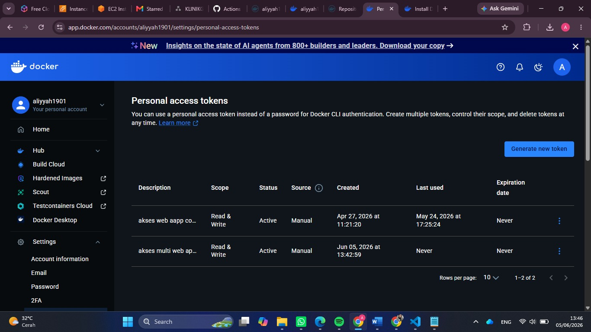

8. Buat secret_key di Github 

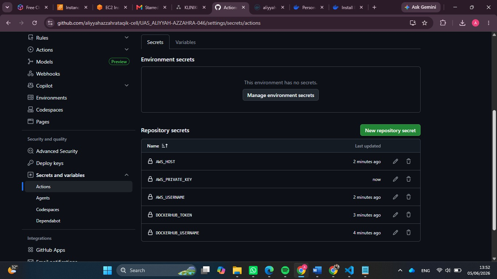

9. Deploy web statis

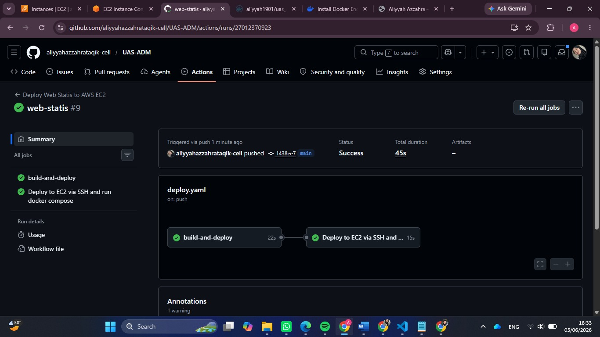 

10. Tampil Web CV Statis

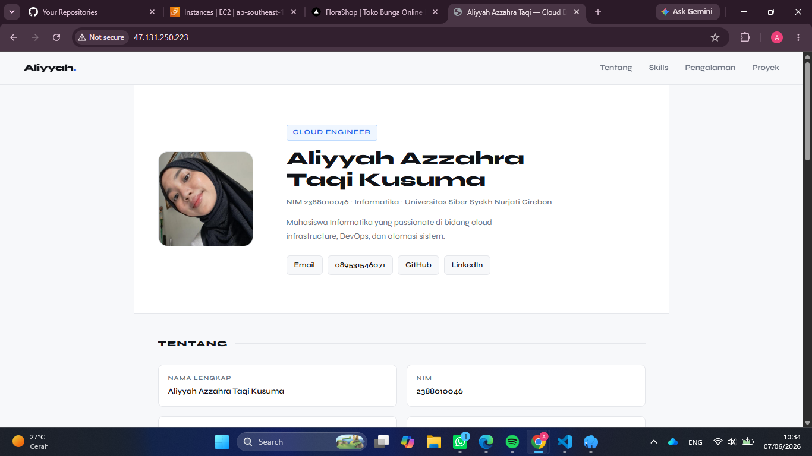

# WEB-DINAMIS
1. Buat db baru 'dbuas' dan buat user account baru 'alyauas046' bberi privelleage untuk db 'dbuas'

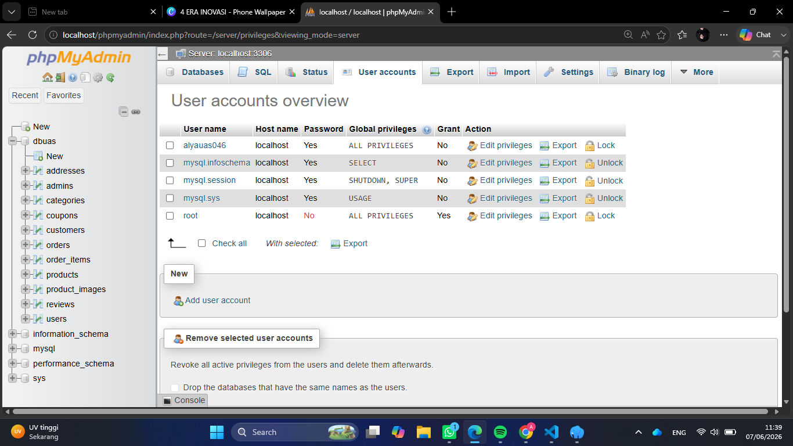

2. Buat repo docker untuk web dinamis

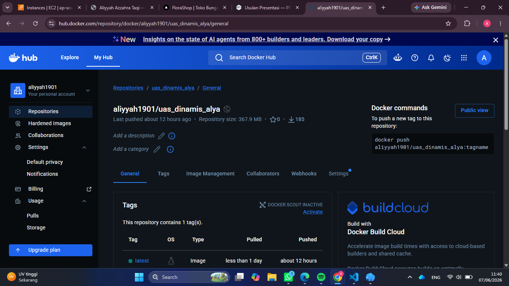 

3. buat Website dinamis (Florist)
    - Buat Dockerfile yg menyesuaikan dengan bahasa dipakai (next.js)
    - Buat juga file docker-compose.yml di dalam folder web-dinamis
    - Buat deploy-web-dinamis.yml

4. Deploy Web-Dinamis
    - Git action Hijau
    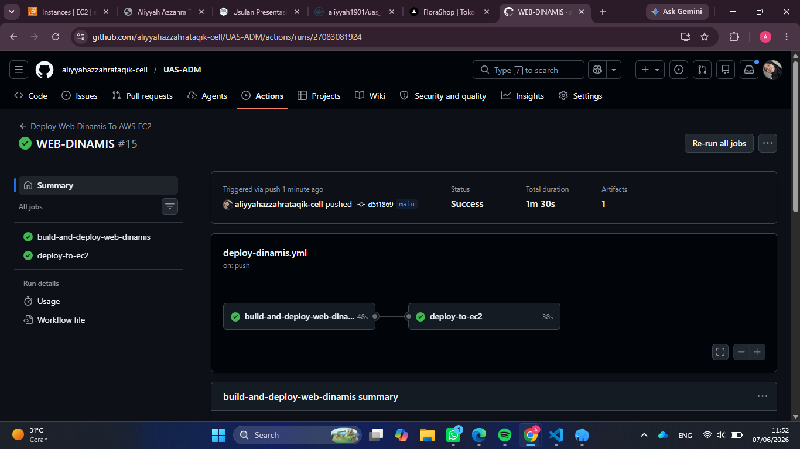
    - Dashboard
    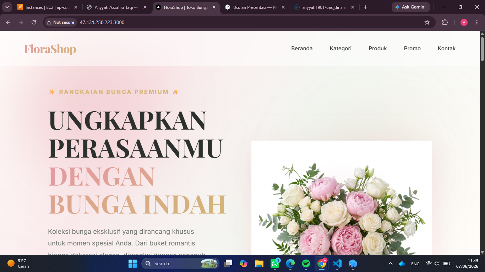
    - Login Admin
    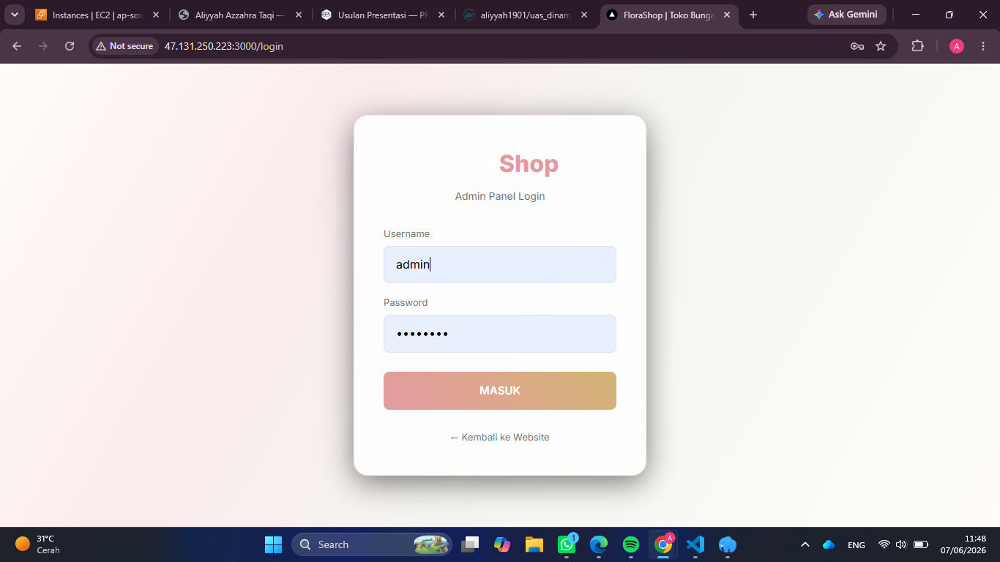
    - Admin
    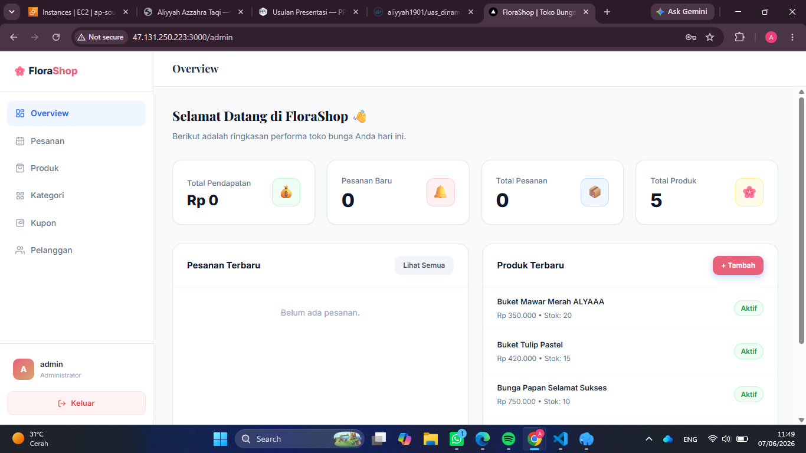 
